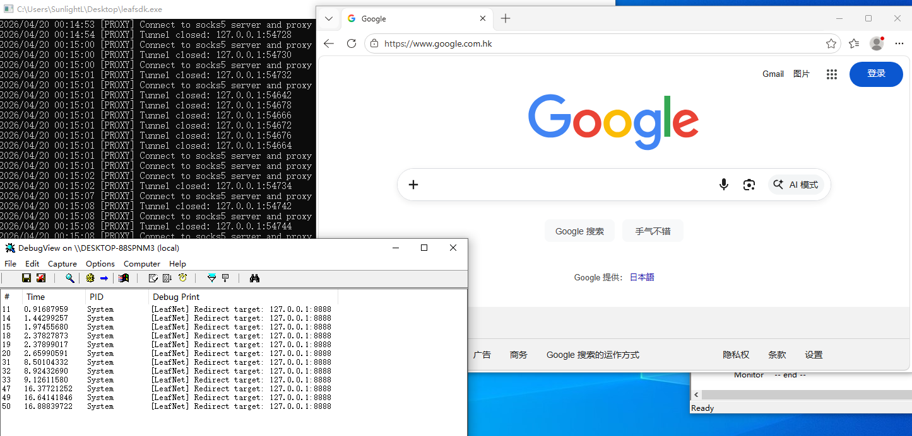

# A net filter project

使用 WFP 实现透明代理。demo 用 Go 语言编写，可拦截所有流量并将其转发到局域网内的 SOCKS5 服务。

Implement a transparent proxy using WFP. The demo is written in Go, which intercepts all traffic and forwards it to a SOCKS5 service on the local network.

## features

* redirect tcp/ipv4 connections

---

## sreenshot

